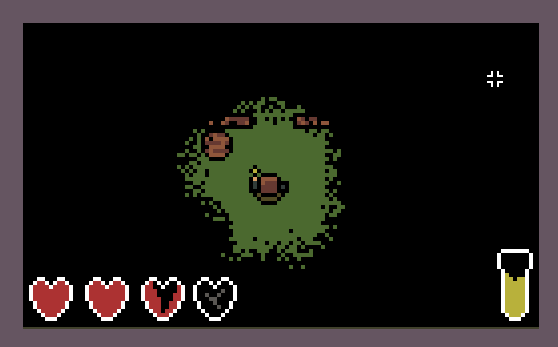
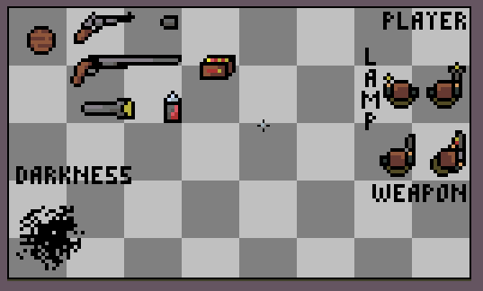
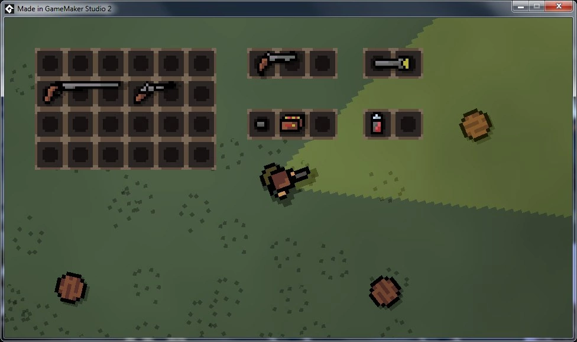
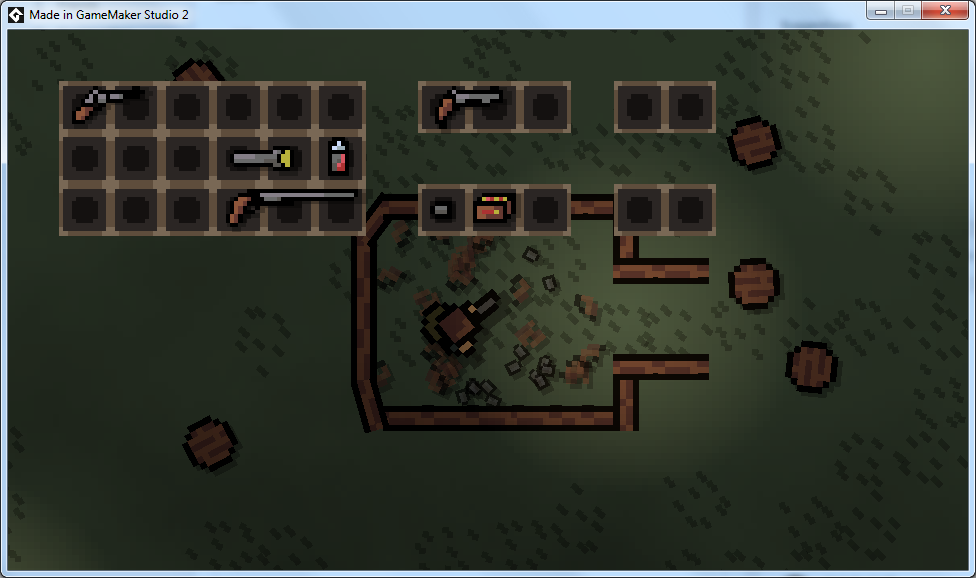
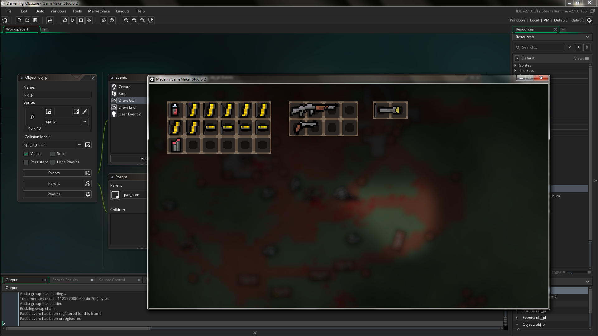
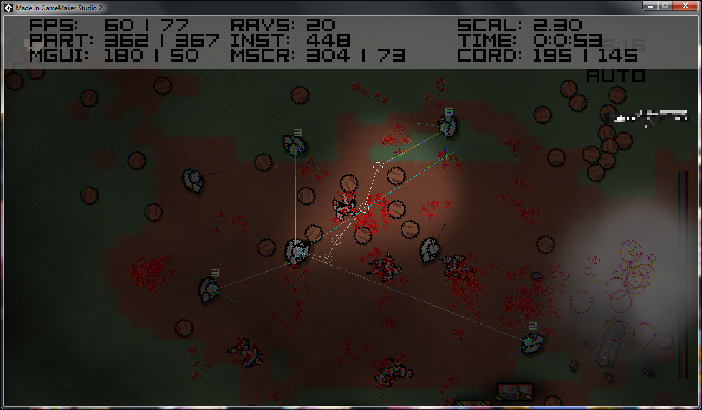
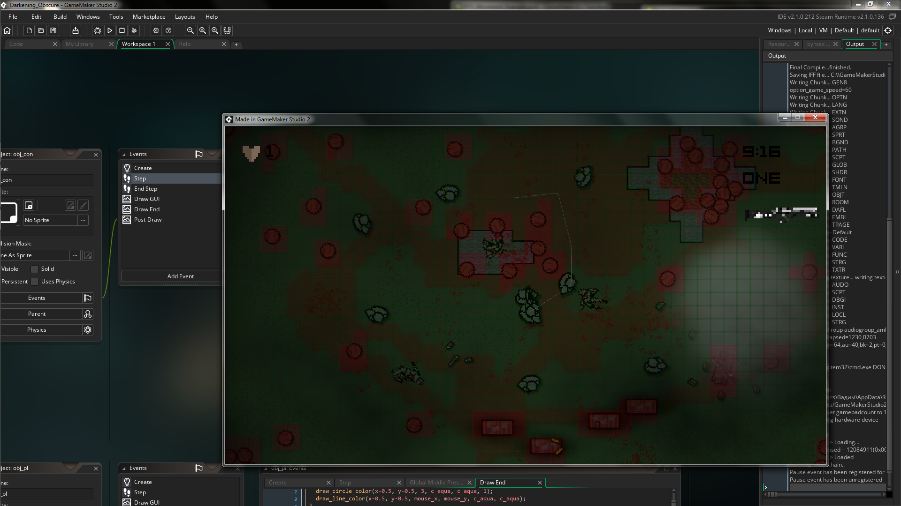
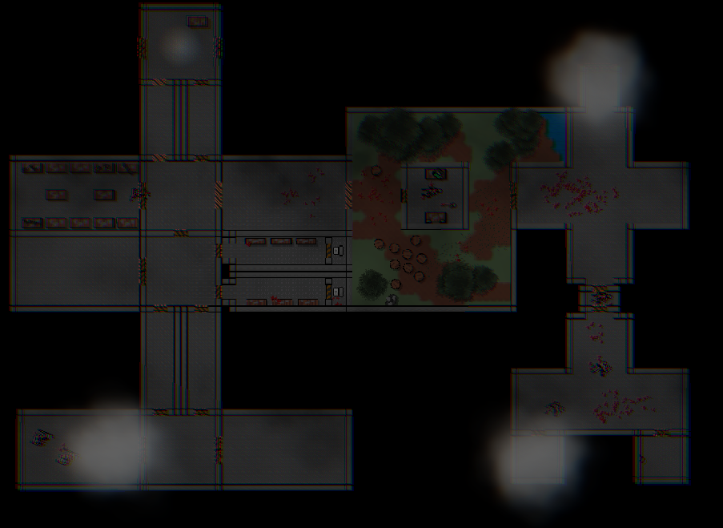

# Darkening

This work is licensed under a <a rel="license" href="http://creativecommons.org/licenses/by-nc-nd/4.0/">Creative Commons Attribution-NonCommercial-NoDerivatives 4.0 International License (CC-BY-NC-ND)</a>.
________________

**Engine - Game Maker: Studio 2**

**Language - Game Maker Language**

**Source Code - Lost**

**Executables - Multiple old versions**

**Development Date - 2017 to 2018**

________________

## Description
This game was a "soft remake" of [Repeater](https://github.com/artificial-studio/archive-2015-repeater-gm81) with different concept and very different visuals. Initially Darkening was set to be a game where you have to keep your light and fight shadows, but it slowly grew to something closer to Hotline Miami. There was also a completely lost version between them of which I only have one small clip. 

## Screenshots
Early concept art

 

Early prototypes

  
 

AI

 

Weapons

 
 

Repeater level remake

